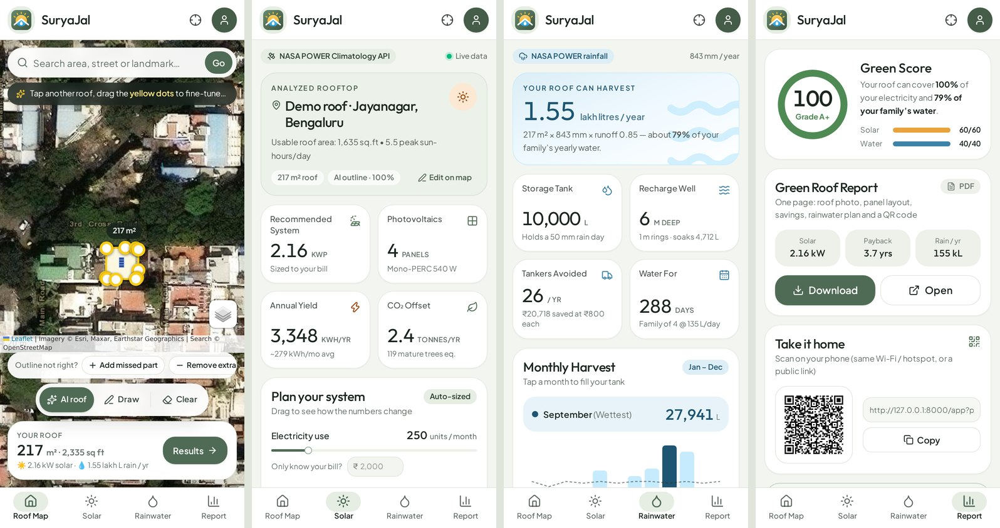
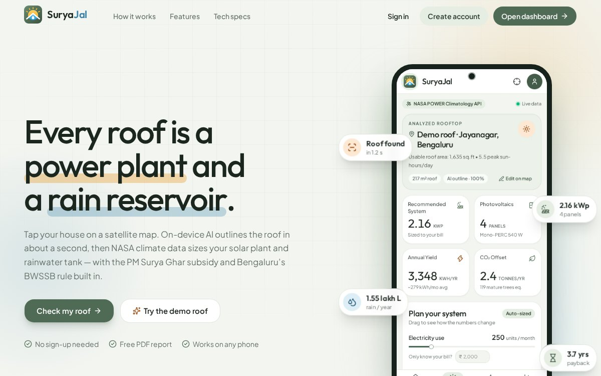
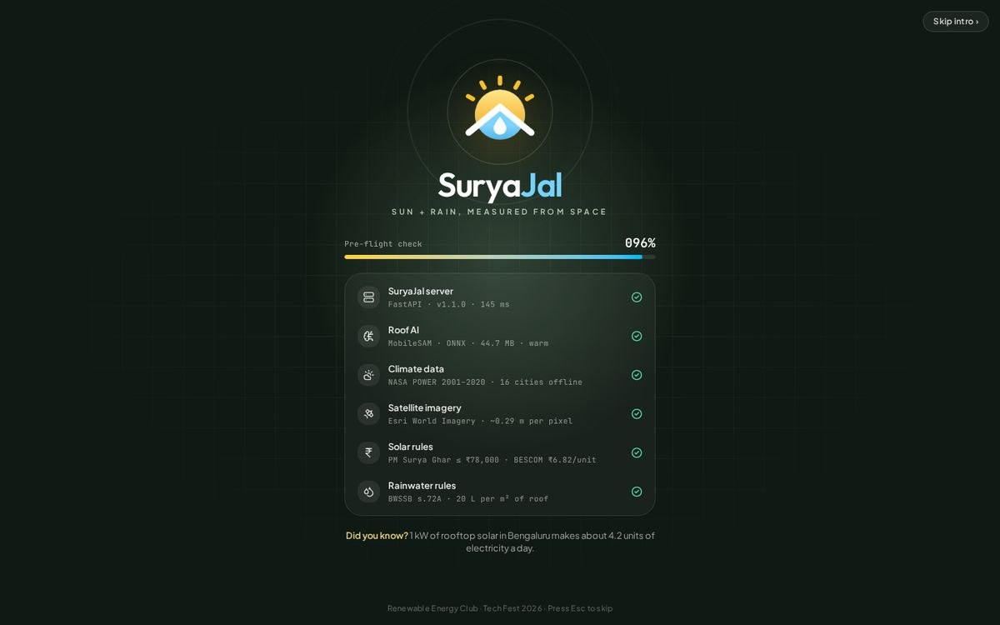
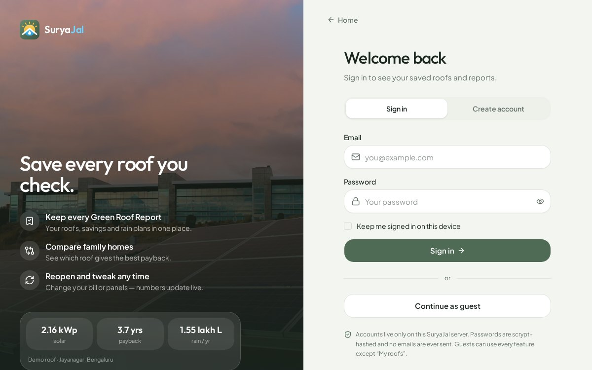
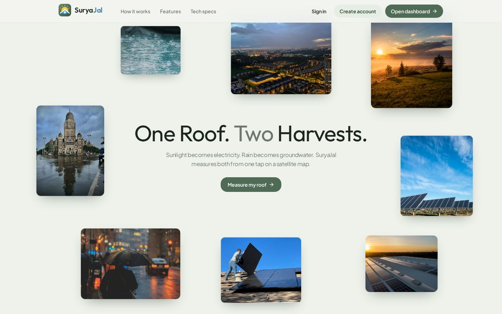

# ☀️💧 SuryaJal — AI Rooftop Solar + Rainwater Planner for Odisha

**Find your house on the satellite map → tap the roof → AI outlines it → get your solar kW, subsidy, payback,
rainwater tank and a one‑page *Green Roof Report* with a QR code — in under a minute.**

Every rule, tariff and subsidy in SuryaJal is **Odisha's**: the OERC domestic slab tariff and electricity duty, net
metering with TPCODL / TPNODL / TPWODL / TPSODL, the PM Surya Ghar central subsidy **plus Odisha's own State
Financial Assistance**, the Odisha Development Authorities rainwater rule (6 m³ of recharge per 100 m² of roof) and
the State's **CHHATA** rooftop‑rainwater subsidy. Climate data is bundled for all **30 districts**.

> **v2.0 (Sep 2026) — the Odisha rebuild:** OERC telescopic slab tariff (₹2.90 / 4.70 / 5.70 / 6.10 per unit) with the
> ₹20/kW fixed charge and 4 % electricity duty, bills computed *before* and *after* solar instead of a flat rate, the
> OERC 90 %-of-consumption net‑metering cap and March settlement at the GRIDCO APPC feed‑in tariff, Odisha SFA on top of
> PM Surya Ghar (up to ₹1.38 lakh at 3 kW), district + DISCOM auto‑detection for any roof, NASA POWER climatology for all
> 30 districts, the ODA Rules 2020 rainwater norm (60 L per m² of roof) and the CHHATA subsidy, three Odisha demo roofs
> (Bhubaneswar, Cuttack, Berhampur) and a map that starts on Bhubaneswar with one‑tap city chips.
>
> **v1.1 (Sep 2026):** new React website and mobile‑first dashboard in a calm sage theme, a new SuryaJal logo, a
> "pre‑flight" loading screen that checks the AI, climate data and imagery live, the scroll‑driven *StackSpread*
> photo story on the landing page, what‑if sliders (bill, panel count), IRR and a 25‑year savings timeline, a
> tank‑fill simulator, and **optional accounts** (sign up · sign in · sign out) with **My roofs**. Guests can still do everything
> except save roofs. The original no‑build tool lives on at `/classic`.

Software project for the Renewable Energy Club tech fest (Nov 2026). It combines SIH25065 (Ministry of Jal Shakti:
on‑spot rooftop rainwater‑harvesting assessment) with rooftop‑solar planning under **PM Surya Ghar: Muft Bijli Yojana**
and **Odisha's State Financial Assistance**, and adds AI roof detection plus Odisha‑specific rules (OERC tariff and net
metering, ODA rainwater norms, CHHATA subsidy).

| Mobile dashboard: Roof Map · Solar · Rainwater · Report |
|---|
|  |

| Landing page | Pre‑flight loader | Sign in |
|---|---|---|
|  |  |  |

| StackSpread story section | One‑page Green Roof Report |
|---|---|
|  |  |

---

## ✨ Features

| | What it does |
|---|---|
| 🤖 **AI roof detection** | Tap a roof. **MobileSAM** (Segment Anything, mobile version, run as ONNX on the CPU) outlines it in about 1 s. **＋ Add part / － Remove** taps refine the outline in about 0.1 s because the image analysis is reused. |
| ✏️ **Manual fallback** | Draw the roof corners yourself. You can drag the corners of any outline, AI or manual, to fine‑tune it. |
| 🧩 **Auto panel layout** | Places real 540 Wp panels on *your* roof shape with a 0.5 m edge gap, shown on the map and in the PDF. It also checks that the panels physically fit. |
| ☀️ **Solar** | Uses NASA POWER monthly sunlight with a temperature‑corrected performance ratio. Gives recommended kW, number of panels, month‑wise units, cost, **PM Surya Ghar + Odisha SFA** subsidy, your **OERC bill before and after**, net‑metering credits, payback, 25‑year savings, CO₂ saved and a trees equivalent. |
| 💧 **Rainwater** | Uses area × rainfall × runoff coefficient. Gives month‑wise litres, storage‑tank size, a recharge well sized to the **Odisha 60 L/m² rule**, the downpipes the ODA Rules require, days of family water, tankers avoided and the **CHHATA** subsidy this roof qualifies for. |
| 🗺️ **District + DISCOM** | Any roof in the State is matched to its district and to TPCODL / TPNODL / TPWODL / TPSODL, so the report says who bills you and where to apply for net metering. |
| 🏅 **Green Score** | 0–100 score and grade (55 points for solar coverage, 35 for rainwater coverage, 10 for meeting the Odisha recharge rule). |
| 📄 **Green Roof Report** | One A4 page showing the roof photo with outline and panels, KPIs, two monthly charts, assumptions and a QR code. |
| 📱 **Take it home** | An on‑screen QR code downloads the PDF on the visitor's phone. Share links keep the whole state in the URL. |
| 📴 **Fest‑proof** | Climate data is cached, and NASA POWER climatology for **all 30 Odisha districts** (32 towns) is bundled offline. Satellite tiles are cached on disk. Three demo roofs — Bhubaneswar, Cuttack and Berhampur — cover you when a visitor can't find their house. |
| 🌍 **Fest counter** | "Today: 23 roofs · 71 kW · 18 lakh L" is shown live and anonymously; only totals are stored. |
| 🎛 **What‑if planner** | Drag your monthly units or pick your own panel count (up to what fits on the roof) and every number, the panel layout and the PDF update live. "Only know your bill?" converts ₹ to units. |
| 📈 **Money view** | Capital cost, PM Surya Ghar + Odisha SFA subsidies, net cost, the OERC bill before and after solar, export settled in March, payback, **IRR** and an interactive **25‑year savings timeline** with the break‑even year — plus a warning when the plant is bigger than your sanctioned load or bigger than the 90 % cap can credit. |
| 🪣 **Tank simulator** | Tap any month on the rain chart and the tank animation fills to show how that month's rain compares with your tank. |
| 🔐 **Accounts (optional)** | Sign up / sign in / sign out, "keep me signed in", sign out on all devices, delete account. Signed‑in users save roofs to **My roofs** and reopen or re‑download them. |
| 🚦 **Pre‑flight loader** | The animated logo plays while the app *really* checks the server, warms MobileSAM, and verifies climate data, Esri imagery and the subsidy/water rules, printing each spec as it comes online. It shows once per browser session; add `?intro` to replay it. |

---

## 🚀 Run it on your laptop

**Get the code** from GitHub:
```bash
git clone https://github.com/harishankarsahu874-jpg/SuryaJal.git
cd SuryaJal
```
(or on GitHub click **Code → Download ZIP** and unzip it).

**You need Python 3.10+** and internet access for the satellite map. Allow about 1 GB of free RAM; the AI uses about 450 MB.

**Windows:** double‑click `run.bat`
**Linux / macOS:** `./run.sh`

Both scripts create a virtual environment, install the requirements, download the MobileSAM models (~45 MB) and
start the server. Then open **http://localhost:8000** (website) or **http://localhost:8000/app** (dashboard).

The React site is **already built** into `static/site/`, so you do **not** need Node.js to run SuryaJal. You only need
Node 20+ if you want to change the UI (see *Frontend* below).

Manual steps if you prefer:
```bash
python -m venv .venv && source .venv/bin/activate      # Windows: .venv\Scripts\activate
pip install -r requirements.txt
python scripts/download_models.py                      # MobileSAM ONNX (~45 MB)
python -m uvicorn app.main:app --host 0.0.0.0 --port 8000
```
Without the model files the app still runs, using a basic OpenCV region‑growing fallback, but MobileSAM is much better.

Run the tests (59 of them: OERC tariff slabs, both subsidies, net‑metering cap, solar and rainwater formulas, CHHATA
eligibility, district/DISCOM lookup, geometry, panel layout, segmentation on a synthetic image, API, PDF, accounts and My roofs):
```bash
pytest -q
```

---

## 🎪 Fest‑day checklist

1. **Start 30 min early.** Open `http://localhost:8000/?intro` — the pre‑flight loader confirms the AI, climate data
   and imagery are all green. Then open the dashboard and tap **Try the demo roof** once.
2. **Use a phone hotspot.** Connect the laptop and visitors' phones to it. Visitors can then scan the on‑screen QR and the PDF
   downloads on their phone from `http://<laptop-ip>:8000`. `run.sh` prints this address; on Windows, run `ipconfig`.
3. **Pre‑visit likely areas.** Open the college area and a few neighbourhoods visitors come from, so tiles are cached.
4. **If the internet dies,** climate data falls back to the bundled NASA POWER data for all 30 Odisha districts. The satellite map needs internet, so keep
   `docs/sample_report.pdf` and the screenshots ready as backup.
5. **Want a public link?** Deploy to Hugging Face Spaces (below). The QR then works from any phone, anywhere.

### 60‑second pitch
> An Odisha roof gets about **4.8–5.1 kWh of sunlight per m² per day** and **1,300–1,850 mm of rain a year**, but families
> don't know what that's worth. With SuryaJal you find your house and tap your roof. **Segment Anything** outlines it in about
> a second, and you instantly see how many panels fit, the cost after the **PM Surya Ghar subsidy plus Odisha's SFA** (up to
> ₹1.38 lakh at 3 kW), your **OERC bill before and after**, the payback, and how much rainwater you must store and recharge
> under the **Odisha Development Authorities rules** — with the **CHHATA** subsidy you can claim for it. It even tells you
> which DISCOM bills you. Scan the QR and take your Green Roof Report home.

### Judge Q&A cheat‑sheet
- **How accurate is the area?** Zoom‑19 imagery is about 0.28 m per pixel at Bhubaneswar's latitude, so roof area is typically within ±5–10%.
  Error comes from trees overhanging the roof and tall buildings leaning in the photo. The corners can be dragged to correct it.
- **Why MobileSAM and not the original SAM?** MobileSAM has about 10 M parameters against SAM‑H's 600 M+, uses the same point‑prompt
  interface, and runs on a plain laptop CPU in about 1 s with no GPU.
- **Where do the numbers come from?** NASA POWER 20‑year climatology for all 30 districts, PM Surya Ghar subsidy slabs,
  Odisha's SFA (Cabinet decision, 03.01.2025), the CEA grid CO₂ factor, the OERC retail supply tariff order for FY 2026‑27
  and OERC's net‑metering orders, GRIDCO's APPC for the export settlement, the Odisha Development Authorities (Planning &
  Building Standards) Rules 2020 and the CHHATA scheme guidelines. All are listed in the app under *Assumptions* and are editable.
- **Why is the export income often zero?** That is Odisha's rule, not a bug: OERC caps credited generation at **90 % of your
  yearly consumption** and anything above that is "free energy" at the March settlement. So the honest advice is to size the
  plant to your own bill — SuryaJal says so and shows how many units would lapse.
- **What's new compared with existing calculators?** AI roof outline, auto panel layout on the real roof shape, solar *and*
  water in one flow, a real **telescopic OERC bill** before and after solar instead of a flat ₹/unit, Odisha's state subsidy,
  district/DISCOM detection, the ODA rainwater rule and CHHATA, a Green Score, and a QR take‑home report. It keeps working
  even with bad Wi‑Fi.
- **Shading?** Not modelled yet. The *usable %* slider covers tanks, stair rooms and trees; see future upgrades.

---

## 🧠 How it works

```
Browser (React + TypeScript + Tailwind + shadcn/ui, Leaflet map; static build served by FastAPI)
   │  tap (lat, lon)                          polygon + inputs                  share state (URL)
   ▼                                          ▼                                  ▼
POST /api/segment                        POST /api/assess                    GET /r?p=…  (PDF)
   │ tiles.py: Esri z19 crop 512×512       │ climate.py: NASA POWER (cached)    │ report.py: reportlab A4
   │ segment.py: MobileSAM encoder         │ layout.py: panel packing           │ roof thumbnail + panels
   │   (embedding cached per crop)         │ solar.py: sizing + money + CO₂     │ charts + QR code
   │   decoder with point prompts          │ rain.py: harvest + tank + well     │
   │ mask → clean → polygon → lat/lon      │ Green Score                        │
```

**Roof detection:**
1. Fetch 3×3 satellite tiles at zoom 19 and crop 512 px centred on the tap (about 150 m × 150 m).
2. MobileSAM's image encoder (ONNX) builds a 64×64×256 embedding.
3. The mask decoder turns the tap into three candidate masks (roof part / roof / whole block). We keep the best one by predicted IoU, provided it contains the tap and is a sensible size.
4. Morphological clean‑up keeps only the region under the tap and fills holes.
5. The outline is simplified with Douglas–Peucker and rescaled so its area matches the mask's pixel count.
6. Pixels are converted to lat/lon with Web‑Mercator maths.

**Auto panel layout:**
1. Find the roof's main axis (minimum‑area rectangle) and rasterise the roof at 10 cm.
2. Shrink it by the 0.5 m edge gap.
3. Try landscape and portrait grids, both axes and 9 grid offsets. Each panel is tested in O(1) with a summed‑area table.
4. Place the recommended number of panels in neat, centred rows.

---

## 📐 The science (all defaults editable in the app)

**Solar**
- Monthly energy: `E_m = kWp × GHI_m × days_m × PR_m`
- Performance ratio: `PR_m = 0.83 × [1 − 0.0035 × (T_air,m + 20 − 25)]`, i.e. PVWatts‑style system losses plus heat loss.
  This gives PR ≈ 0.75 and about **3.7 units/day per kW in Bhubaneswar** (1,352 kWh/kWp/year; 3.9–4.1 in western Odisha).
- Size: `min(roof limit, household need)`
  - Roof limit = `usable area ÷ 10 m² per kW`, also capped by how many panels fit geometrically.
  - Household need = `annual units ÷ yearly units per kW`.
- **Bill, not a flat rate.** Odisha's domestic tariff is telescopic, so SuryaJal bills the home twice:
  `bill = energy(units, slabs) + ₹20/kW/month + 4 % duty` for the units you *would* use, and again for the units you
  still import after solar. `saving = bill_before − bill_after + export_paid × feed‑in tariff`. A solar unit therefore
  displaces your **dearest** unit (₹6.10 above 400 units/month, ₹2.90 in the first slab) — not an average one.
  Kutir Jyoti homes (≤ 30 units/month) pay a flat ₹70, which the model also handles.
- **Net metering (OERC).** Credits carry forward inside the financial year; generation is credited only up to
  **90 % of the year's consumption**, and whatever is above that on 31 March is "free energy" (reset to zero in April).
  Fixed charges and government levies are always payable. Plant size ≤ sanctioned load (max 500 kW) and ≤ 75 % of the
  DT capacity; SuryaJal warns you when a load enhancement is needed.
- Subsidies (both apply to homes, up to 3 kW):
  - PM Surya Ghar CFA: `₹30,000 × min(kW,2) + ₹18,000 × (min(kW,3) − 2)`, capped at ₹78,000.
  - Odisha SFA: `₹25,000 × min(kW,2) + ₹10,000 × (min(kW,3) − 2)`, capped at ₹60,000 → **₹1,38,000 at 3 kW**.
  - Never more than the system actually costs; each can be switched off in *Assumptions*.

**Rainwater**
- Harvest: `litres = roof m² × rain mm × runoff C` (1 mm on 1 m² = 1 L). Solar panels don't reduce this.
- Storage tank holds one heavy‑rain day: `area × 100 mm × C`, rounded up to a standard tank size (Odisha's monsoon
  delivers 60–80 % of the year's rain between July and October, and 100 mm days are common).
- Recharge well: 1 m Ø RCC rings (785 L per metre depth), sized to the **Odisha norm `60 L × roof m²`**
  (= 6 m³ per 100 m² of roof), plus the two 100 mm downpipes per 100 m² the rules ask for.
- Water demand: family × 135 L/person/day (CPHEEO norm).
- **CHHATA subsidy:** `min(50 % of the system cost, ₹55,000)` for roofs of 50–200 m² in buildings of at most three
  floors, with a recharge unit compulsory. SuryaJal checks eligibility and explains why a roof misses out.

| Default | Value | Source |
|---|---|---|
| Roof area per kW | 10 m² | PM Surya Ghar national portal FAQ |
| Central subsidy | ₹30k/kW up to 2 kW + ₹18k for 3rd kW, max ₹78k | PM Surya Ghar: Muft Bijli Yojana |
| Odisha subsidy (SFA) | ₹25k/kW up to 2 kW + ₹10k for 3rd kW, max ₹60k | State Cabinet decision, 03.01.2025 (FY 2024‑25 → 2026‑27) |
| Installed cost | ₹55,000/kW | 2026 Odisha market, OREDA‑empanelled vendors (~₹48k–65k/kW for 1–5 kW) |
| Tariff | telescopic slabs ₹2.90 / 4.70 / 5.70 / 6.10 per unit, ₹20/kW/month fixed, 4 % duty extra | OERC retail supply tariff, FY 2026‑27 (order 24.03.2026, unchanged for the 5th year) |
| Kutir Jyoti | flat ₹70/month up to 30 units | OERC domestic tariff |
| Export / settlement | ₹3.59 per unit, credited up to 90 % of yearly consumption | GRIDCO APPC FY 2026‑27; OERC net‑metering orders |
| Grid CO₂ | 0.71 kg/unit | CEA CO₂ Baseline Database v21 (FY 2024‑25) |
| Runoff C | RCC 0.85, metal/GI 0.90, clay tile 0.75, cement sheet 0.80 | typical engineering values |
| Rainwater rule | 60 L per m² of roof (6 m³ per 100 m²), mandatory above 100 m² plot, recharge above 225 m² | Odisha Development Authorities (Planning & Building Standards) Rules, 2020 |
| CHHATA subsidy | 50 % of cost or ₹55,000, whichever is less; roof 50–200 m², ≤ 3 floors | Dept. of Water Resources, Govt. of Odisha (FY 2022‑23 → 2026‑27) |
| Rainwater system cost | ₹600 per m² of roof | Odisha market for pipes + filter bed + recharge pit |
| Water demand | 135 L/person/day | CPHEEO manual |
| Climate | monthly sunlight, rain, temperature for 32 Odisha towns | NASA POWER climatology 2001–2020 |

**Known limitations (be honest with judges):**
- NASA POWER uses a grid of roughly 0.25° (~25 km). For Bhubaneswar it gives about 1,573 mm of rain a year against the IMD
  normal of roughly 1,500 mm — close, but coastal and southern Odisha vary a lot (Paradeep ~1,850 mm, Bhawanipatna ~1,335 mm),
  so use the *annual rainfall* override for local accuracy. Nearby towns can share a grid cell (Cuttack ≈ Bhubaneswar).
- Shading from neighbouring buildings is not modelled.
- Imagery may be a few years old; use *Draw* for new buildings.
- Costs and tariffs change, so they are editable.

---

## 🔌 API

| Method | Path | Purpose |
|---|---|---|
| GET | `/api/health` | Status and AI engine (`mobilesam` or `opencv`) |
| GET | `/api/config` | Defaults, roof types, sources, plus the Odisha block (DISCOMs, tariff slabs, rainwater rule, CHHATA, 32 towns) |
| GET | `/api/odisha/table` | Sunlight, rainfall, district and DISCOM for every bundled Odisha town |
| GET | `/api/odisha/locate?lat=&lon=` | District + DISCOM (TPCODL / TPNODL / TPWODL / TPSODL) for a point |
| GET | `/api/odisha/tariff?units=&load_kw=` | Itemised OERC domestic bill for a month |
| GET | `/api/geocode?q=` | Place search (Nominatim proxy, throttled to 1 req/s, cached, biased to Odisha and tagged with district + DISCOM) |
| GET | `/api/reverse?lat=&lon=` | Short address for the report |
| POST | `/api/segment` | `{points:[{lat,lon,label}], zoom}` → roof polygon, area, confidence |
| POST | `/api/assess` | `{polygon:[[lat,lon],…], monthly_units, family_size, …}` → solar, rain, score, panel layout |
| GET | `/r?p=<polyline>&u=&f=&rt=&uf=…` | One‑page PDF report, stateless; this is also what the QR code opens |
| GET | `/api/qr.svg?data=` | QR code as SVG |
| GET | `/api/stats` | Anonymous fest counter |
| GET | `/api/thumb?p=…` | Satellite photo of the roof with the panel layout (JPEG, used by the dashboard) |
| POST | `/api/auth/signup` | `{name, email, password}` → `{token, user}` |
| POST | `/api/auth/login` | `{email, password, remember}` → `{token, user}` (8 wrong tries per 10 min → 429) |
| POST | `/api/auth/logout` | Revokes the current token (`?everywhere=true` → all devices) |
| GET / DELETE | `/api/auth/me` | Current user · delete account (needs `{password}`) |
| GET / POST | `/api/roofs` | List / save a roof (`{query, title}`; the server recomputes the numbers) |
| DELETE | `/api/roofs/{id}` | Remove a saved roof |

Auth uses `Authorization: Bearer <token>`. Pages: `/` website · `/app` dashboard · `/login` · `/signup` · `/account` ·
`/demo` (StackSpread on its own) · `/classic` (original tool). Old `/?p=…` share links redirect to `/app?p=…`.

Interactive docs are at **http://localhost:8000/docs**.

---

## 🗂 Project structure

```
suryajal/
├── app/
│   ├── main.py        FastAPI routes
│   ├── config.py      defaults + sources (single source of truth)
│   ├── segment.py     MobileSAM ONNX + OpenCV fallback + mask→polygon
│   ├── tiles.py       Esri tile fetch, cache, placeholder detection
│   ├── layout.py      auto solar-panel packing
│   ├── tariff.py      OERC telescopic domestic bill (slabs, fixed charge, duty, Kutir Jyoti)
│   ├── odisha.py      districts, DISCOM lookup, bundled NASA POWER table for the State
│   ├── solar.py       sizing, economics (bill before/after + net metering), subsidies, CO₂
│   ├── rain.py        harvest, tank, recharge well, ODA rule check, CHHATA, Green Score
│   ├── climate.py     NASA POWER + cache + offline fallback
│   ├── geo.py         Web-Mercator, polygon area, encoded polyline
│   ├── report.py      one-page PDF (reportlab) + QR
│   ├── stats.py       anonymous fest counter
│   ├── auth.py        accounts: SQLite users, scrypt passwords, hashed bearer tokens, My roofs
│   └── fonts/         DejaVu Sans (₹ symbol in PDF)
├── frontend/          React + TypeScript + Tailwind v4 + shadcn/ui source (Vite)  → builds into static/site
├── static/
│   ├── site/          built website + dashboard (committed, served at / and /app)
│   └── index.html …   classic no-build tool (served at /classic)
├── data/climate_fallback.json   NASA POWER climatology for 32 Odisha towns (all 30 districts) + district/DISCOM
├── models/            MobileSAM ONNX (downloaded)
├── scripts/           download_models.py, prefetch_climate.py
├── tests/             59 pytest tests
├── docs/              screenshots + sample report
├── run.sh · run.bat · Dockerfile · requirements.txt
```

---

## 🎨 Frontend (React + TypeScript + Tailwind CSS + shadcn/ui)

```
frontend/
├── components.json              shadcn config  → aliases: @/components, @/components/ui, @/lib/utils
├── vite.config.ts               @ → src, Tailwind v4 plugin, dev proxy to :8000, build → ../static/site
├── public/brand/                logo-mark.svg, logo-glyph.svg, favicon + app icons, og.png
├── public/images/               Unsplash photos (self-hosted) + dashboard screenshot
└── src/
    ├── components/ui/           shadcn primitives + stack-spread.tsx  ← the integrated component
    ├── components/demo/         stack-spread-demo.tsx (the component's demo, route /demo)
    ├── components/brand/        logo.tsx: LogoMark, AnimatedLogoMark, Logo (wordmark)
    ├── components/preflight-loader.tsx
    ├── components/site/         header, footer, user menu (sign in / sign out)
    ├── features/dashboard/      state (assessment, URL sync), Leaflet map, Solar / Rain / Report views
    ├── pages/                   landing, dashboard, login (+ signup), account (My roofs), demo, 404
    └── lib/                     api.ts (typed client), auth.tsx (AuthProvider), geo.ts, format.ts, utils.ts (cn)
```

**Change the UI:**
```bash
cd frontend
npm install
npm run dev      # http://localhost:5173 - hot reload; /api, /r, /app… are proxied to uvicorn on :8000
npm run build    # type-checks, then writes the production site to ../static/site
```

**How this project was set up** (if you start a new one):
```bash
npm create vite@latest frontend -- --template react-ts        # TypeScript
cd frontend && npm install tailwindcss @tailwindcss/vite       # Tailwind v4 (+ plugin in vite.config.ts)
# tsconfig.json + tsconfig.app.json:  "paths": { "@/*": ["./src/*"] }
npx shadcn@latest init -d -b radix                              # writes components.json, src/lib/utils.ts, theme CSS
npx shadcn@latest add button card input label badge dropdown-menu avatar separator switch slider \
    sonner skeleton tabs checkbox tooltip alert-dialog select progress
npm install motion lucide-react react-router-dom leaflet @types/leaflet
```

**Why `src/components/ui`?** It is the folder shadcn's CLI writes into (the `ui` alias in `components.json`), and the
component's demo imports `@/components/ui/stack-spread`. Keeping every reusable primitive there means `npx shadcn add …`
never overwrites your feature code, imports stay short and stable (`@/components/ui/…`), and anyone who knows
shadcn can find things immediately. App‑specific pieces live in `components/site`, `components/brand` and `features/`.

**StackSpread notes:** client‑only (uses `motion/react` scroll + spring hooks, no context provider needed). Props:
`scrollLength`, `bgColor`, `textColor`, `cardRadius`, `stackScale`, `clusterRotation`, `textFadeStart`,
`showScrollHint`, plus SuryaJal additions `title` / `highlight` / `titleEnd` / `subtitle` / `action` / `cards`.
On touch screens (`pointer: coarse`) it switches to a 2‑column stack and drops the pointer parallax; it respects
*reduce motion*. The left column shows rain, the right column sun and the centre the roofs that catch both.

**Accounts & security:** passwords are hashed with scrypt (stdlib), sessions are random 256‑bit tokens stored only as
SHA‑256 hashes, failed logins are throttled, and redirects after sign‑in only allow in‑app paths. Tokens live in
`localStorage` ("keep me signed in") or `sessionStorage` (default — good for the shared fest laptop). Everything is in
`data/suryajal.db`; delete that file to wipe all accounts.

---

## ☁️ Free public deploy (Hugging Face Spaces)

1. Create a new Space and choose **Docker** as the SDK.
2. Upload this folder, leaving out `.venv`, `.cache` and `models/*.onnx`; the Dockerfile downloads the models.
3. Put this at the very top of the Space's `README.md`:
   ```yaml
   ---
   title: SuryaJal
   emoji: ☀️
   sdk: docker
   app_port: 7860
   ---
   ```
4. Wait for the build. You get a public HTTPS link, and the QR codes work from any phone.

## ☁️ Deploy on Render (Docker)

The same `Dockerfile` works on [Render](https://render.com) - no code changes and **no secrets / API keys** are
needed (NASA POWER, Esri imagery and Nominatim are all key‑less).

1. **New → Web Service**, connect the `SuryaJal` GitHub repo and fill the form:

   | Field | Value |
   | --- | --- |
   | Language | **Docker** (Render finds the `Dockerfile` at the repo root) |
   | Branch | `main` |
   | Region | **Singapore** is the closest to Odisha; Oregon works too, just ~200 ms further away |
   | Root Directory | leave empty |
   | Instance type | **Starter** (512 MB) or better - see the memory note below |
   | Advanced → Health Check Path | `/api/health` |
   | Environment variables | none required (`PORT` is injected by Render; the container reads it) |

2. Click **Deploy web service**. The first build takes ~5 min: it installs the Python wheels and downloads the
   MobileSAM models (~45 MB) *into the image*, so cold starts never re‑download them.
3. Open `https://<your-service>.onrender.com/api/health` - you should see `"engine": "mobilesam"` and, a few
   seconds later, `"ready": true`. Share links and the QR code use the public HTTPS URL automatically
   (`--proxy-headers` in the Dockerfile).

**Keep accounts across deploys (optional).** The container disk is wiped on every deploy/restart, so
`data/suryajal.db` (accounts, saved roofs) and `data/stats.json` (fest counter) are lost unless you add a
persistent disk (Starter plan or higher, from 1 GB):

| Setting | Value |
| --- | --- |
| Disk → Mount path | `/var/data` (**not** `/app/data`, which would hide the bundled `climate_fallback.json`) |
| Env var `SURYAJAL_DATA_DIR` | `/var/data` |
| Env var `SURYAJAL_CACHE_DIR` | `/var/data/cache` (optional - keeps the satellite‑tile / climate cache warm too) |

**Memory & CPU.** MobileSAM runs on the CPU. The app idles at ~100 MB and the ONNX encoder needs a few hundred
MB more on the first tap, so the 512 MB Starter instance is workable but tight - watch the *Metrics* tab after
the first few AI detections; if the service restarts with an out‑of‑memory event, move to the 2 GB instance.
ONNX Runtime automatically limits its threads to the container's CPU quota (override with `SURYAJAL_THREADS`).
The **Free** instance also works for demos, but it sleeps after 15 min of inactivity (the next visitor waits
~1 min for the cold start) and cannot have a persistent disk.

Every push to `main` redeploys automatically (Settings → *Auto‑Deploy*).

---

## 🔭 Future upgrades
- **Shadow analysis:** sun path plus building heights (e.g., Google Open Buildings 2.5D) to find truly shade‑free area.
- **Obstacle detection:** automatically find black water tanks and stair rooms (fine‑tuned YOLO) and use that instead of the usable‑% slider.
- **Odia / Hindi interface** with voice read‑out of the report.
- **Hybrid/battery and EV‑charging sizing;** add a live IoT generation dashboard (links with the club's hardware projects).
- **Ward‑level heat‑map** of rooftop solar and rainwater potential by batch‑processing OpenStreetMap building footprints,
  ward by ward for BMC, CMC and the other Odisha ULBs in the CHHATA scheme.
- **DISCOM workflow:** pre‑filled net‑metering and OREDA/CHHATA application forms per DISCOM, with the sanctioned‑load
  enhancement the plant needs.

## 🙏 Credits & licences
- [MobileSAM](https://github.com/ChaoningZhang/MobileSAM) (Apache‑2.0), with the ONNX export by [Acly/MobileSAM](https://huggingface.co/Acly/MobileSAM) (MIT).
- [Segment Anything](https://segment-anything.com) by Meta AI (Apache‑2.0).
- [Leaflet](https://leafletjs.com) (BSD‑2).
- [React](https://react.dev), [Vite](https://vite.dev), [Tailwind CSS](https://tailwindcss.com), [shadcn/ui](https://ui.shadcn.com) + Radix UI,
  [motion](https://motion.dev), [lucide](https://lucide.dev) icons (all MIT/ISC).
- *StackSpread* component built with [Hyperiux Vault](https://vault.hyperiux.com).
- Photos from [Unsplash](https://unsplash.com) (Unsplash License); the source URLs are listed in `frontend/src/components/ui/stack-spread.tsx`.
- Fonts: Outfit, Plus Jakarta Sans, JetBrains Mono (SIL OFL) via Fontsource.
- Imagery © Esri, Maxar, Earthstar Geographics & GIS User Community (attribution kept on the map and PDF; educational demo use).
- Climate data from the [NASA POWER](https://power.larc.nasa.gov) Project.
- Search by [Nominatim](https://nominatim.org) / © OpenStreetMap contributors. The app respects the 1 request/s usage policy.
- DejaVu fonts (free licence).

*SuryaJal gives screening estimates for awareness. Get a site survey from an MNRE/OREDA‑empanelled vendor, apply on
pmsuryaghar.gov.in, and register for net metering with your Odisha DISCOM before buying.*
